# Приветствие
Добро пожаловать в команду переводчиков! В этом гайде я объясню, как работать с репозиторием на GitHub, чтобы помогать переводить текстовые файлы игры. Мы будем использовать GitHub как основную платформу для совместной работы. Следуя этому гайду, вы сможете вносить изменения в файлы перевода, отслеживать прогресс и помогать команде.
 
# Как читать этот гайд

### Вариант для тех кто хочет добавить перевод побыстрее: следуйте скриншотам, игнорируя текст.
### Вариант для тех кто хочет разобраться с гитхабом: в тексте встречаются термины, которые потом можно уточнить читая руководства от других людей по гитхабу.

# Как помочь нам с переводом
 1. Прежде чем начать работать с репозиторием, вам нужно создать учетную запись на [GitHub](https://github.com/)
 
 1. Для того чтобы иметь возможность предлагать изменения, сначало нужно сделать форк [этого](https://github.com/Inejka/MGQ-Paradox-Translation-Part-3) репозитория
 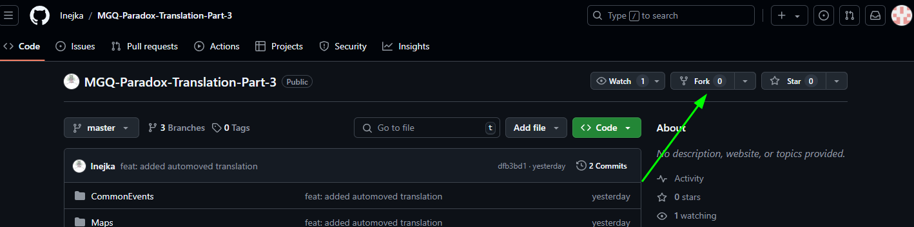
 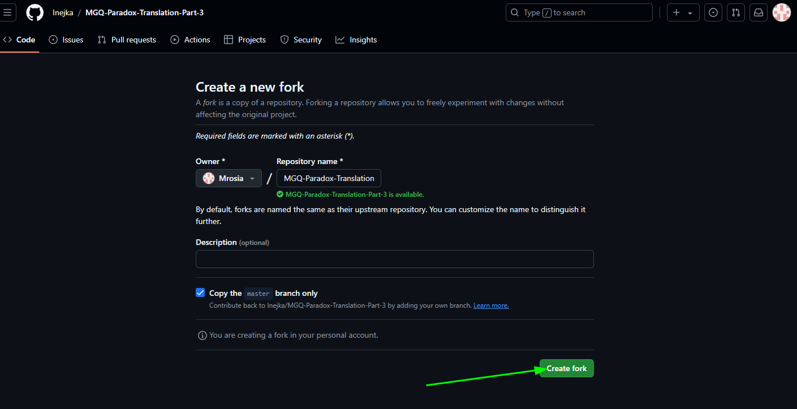
 1. Теперь у вас есть копия репозитория с переводом. Копию порой требуется обновлять, если в основном репозитории кто-то обновил перевод. Алгоритм обновления следующий:
    1. Перейдите в репозиторий и посмотрите на изменения в главной (master) ветке.
    1. Если есть новые изменения, откройте ваш Pull Request.
    1. GitHub предложит вам вариант обновить ветку с помощью кнопки Update branch (Обновить ветку).
 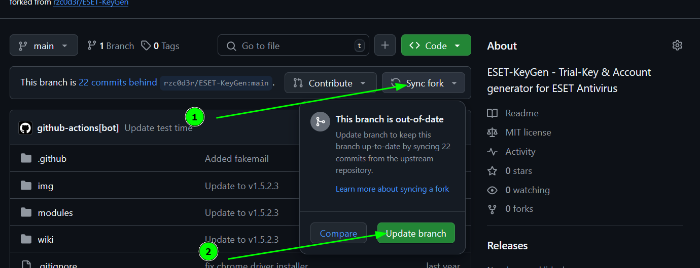
1. Предположим, вы закончили работу над файлом, и готовы внести перевод в этот репозиторий. Для начала необходимо создать новую ветку в вашем копии репозитория.
    1. Откройте список всех ваших ветвей, он может отличаться от того что в примере! 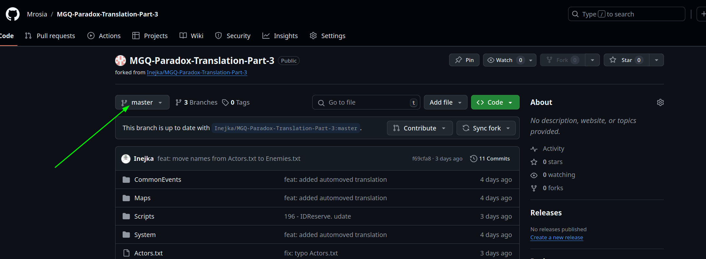
    1. Введите в текстовое поле имя вашей будующей ветки, имя нужно давать осмысленные, чтобы оно вкратце говорили о том, какие изменения вы хотите внести (описание желательно давать на русском языке, не более пяти слов). Далее по нажатию кнопки создаем новую ветку. 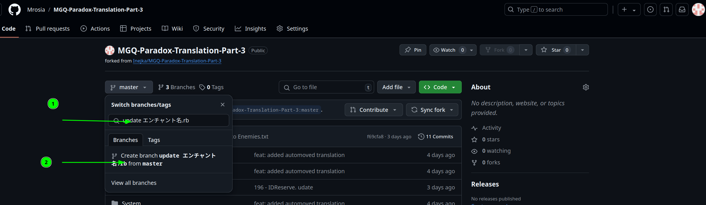
    1. Убедитесь, что вы выбрали правильную ветку для того чтобы добавить обновленный файл. 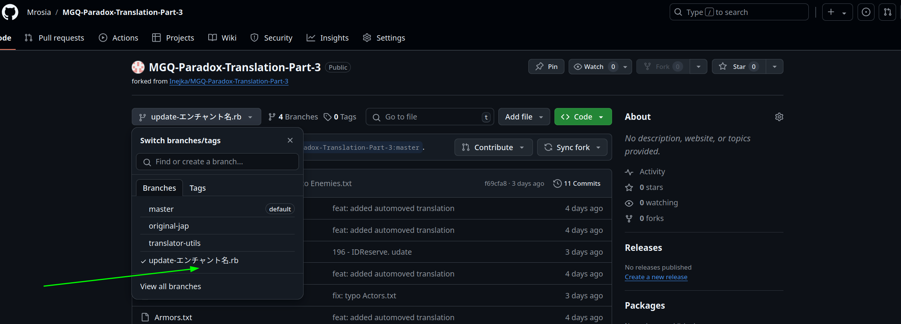
    1. Далее необходимо открыть папку с файлом, который вы хотите обновить, если файл находится в корневой папке проекта, этот этам можно пропустить. Для примера я буду обновлять следующий файл: Scripts/基盤システム/134 - エンチャント名.rb. Перехожу в папку с файлом.
    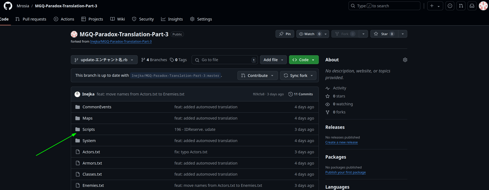
    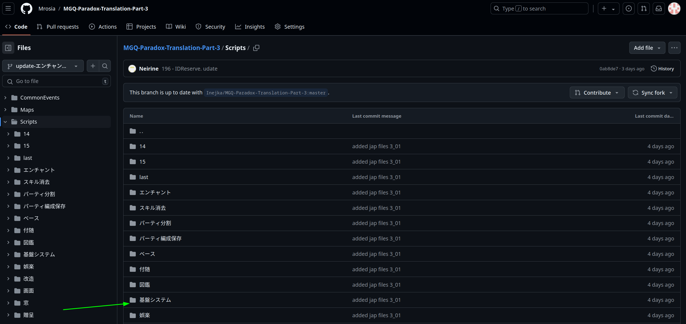
    1. Далее нажимаем на кнопку "Add file", затем "Upload files". 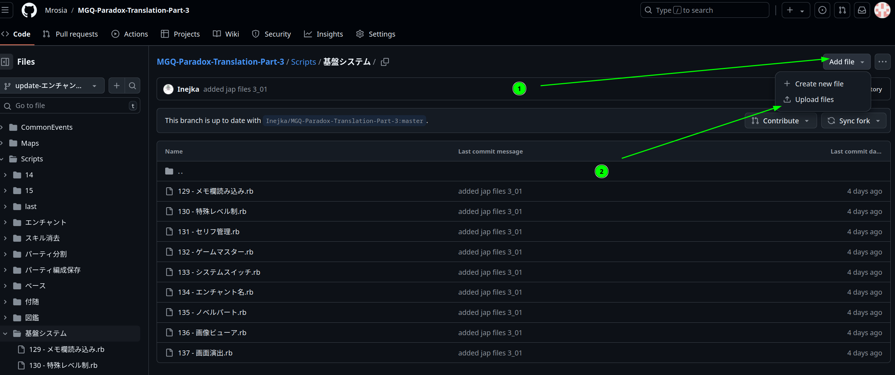
    1. Далее загружаете файлы, которые хотите обновить, вводите краткое описание обновления (описание желательно давать на русском языке, не более десяти слов), и нажимаете кнопку "Commit changes". 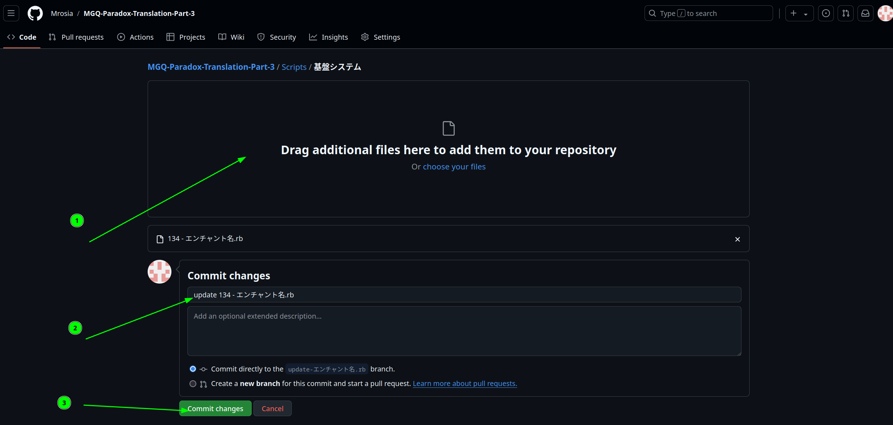
1. После того как вы добавили в свой репозиторий все файлы, которые хотели обновить на текущий момент, в вашей копии репозитория должна появится плашка с предложением сделать pull request. Выбираете пунк "Compare & pull request", и далее на новой странице "Create pull request" 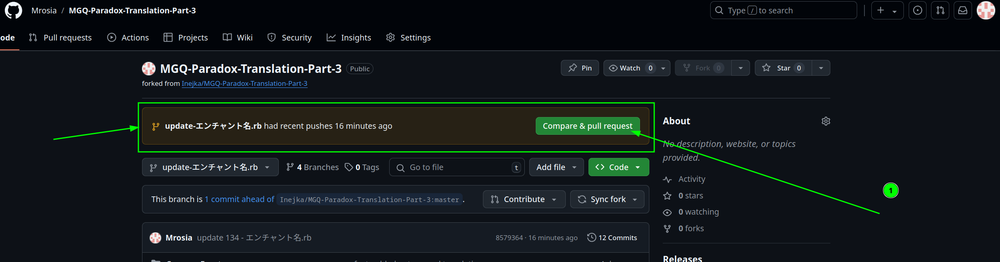 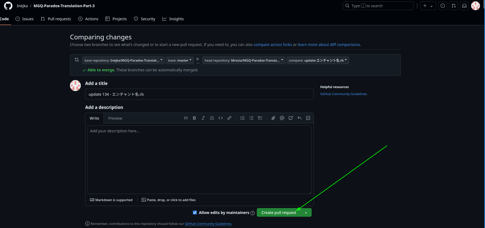
1. На этом пока текущая версия гайда заканчивается, нам пришли ваши файлы. Для того чтобы снова обновить какие-либо файлы нужно повторить все начиная с четвертого шага.
1. P.S. Если вы вдруг потеряли вашу копию репозитория, найти ее можно следующим образом.  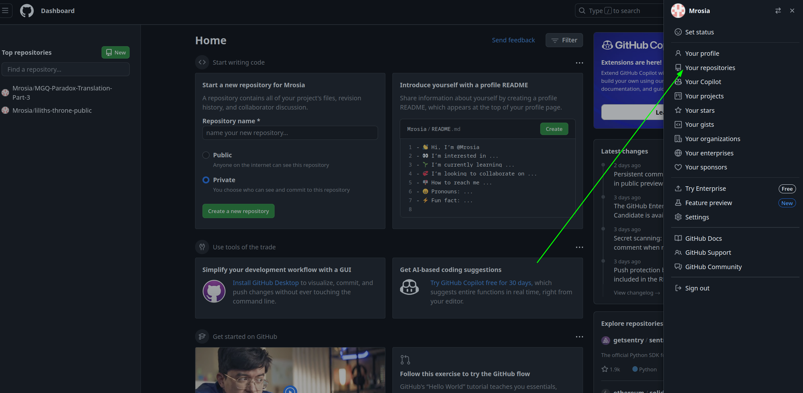
